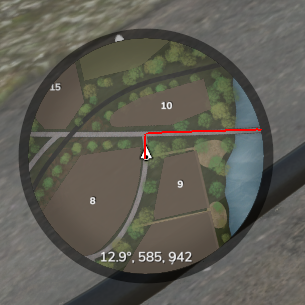
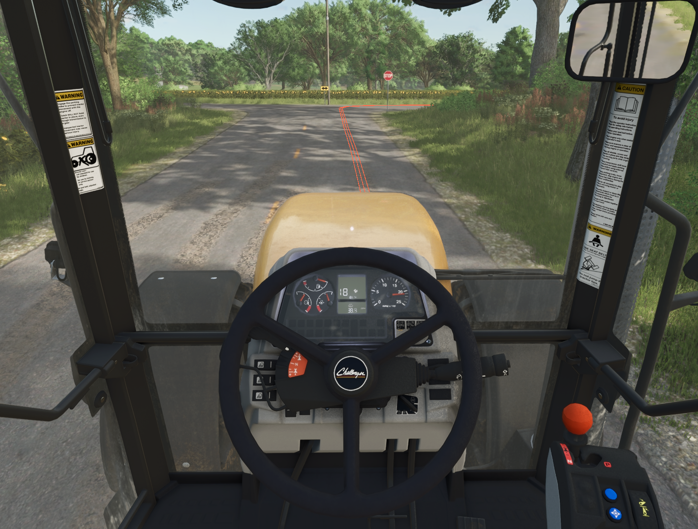
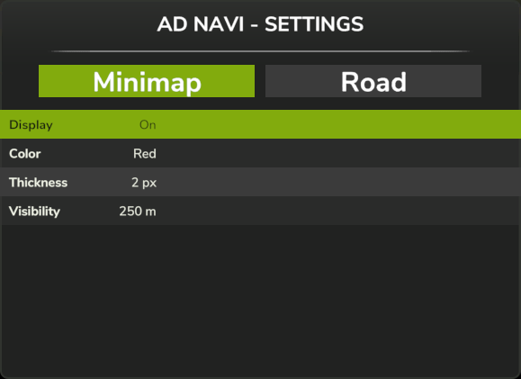
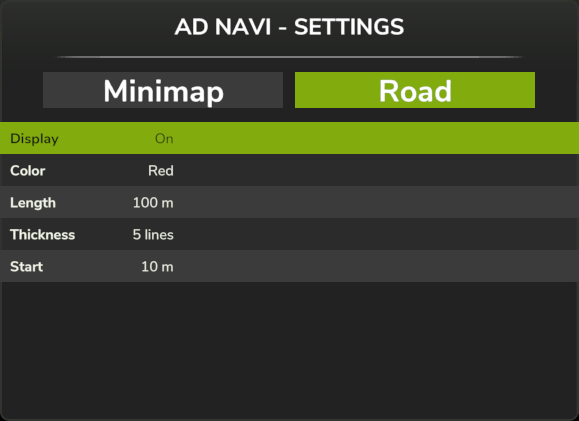

# FS25 AutoDrive Navi AddOn

Transparency notice: This mod has been created with AI.

This mod will add a satellite navigation to the [AutoDrive](https://github.com/Stephan-S/FS25_AutoDrive) mod. Jump into your vehicle, choose a destination from the AutoDrive menu, press RightShift+N and your path will be shown on the minimap.

There's also a line on the road will guide you. 

Press CTRL+RightShift+N to open the settings. Navigate through the lines with the arrow keys (up and down), or simply click on them. Cycle through the settings with the arrow keys (left and right) or A and D. With Q and E you can switch between "Minimap" and "Road".

- Display: If you like to use only the lines on the road, you can turn the minimap lines off.
- Color: Cycle through some different colors.
- Thickness: Set the thickness of the line.
- Visibility: Show a shorter or longer line on the minimap. Please note, that if the line is too long, it will garble at the end of the minimap. The large minimap will always be shown in the entire length.

- Display: If you like to use only the line on the minimap, you can turn the road lines off.
- Color: Cycle through some different colors.
- Length: Show a longer or a shorter line in front of you.
- Thickness: The thickness will be defined by the number of thin lines you see.
- Start: Let the lines start farther or closer in front of you.

Feel free to modify the mod to your likeness.

This mod has been tested with AutoDrive version 3.0.1.2 on the map Riverbend Springs.
It requires the AutoDrive mod, for obvious reasons. You probably already use it anyway, as everyone does.
